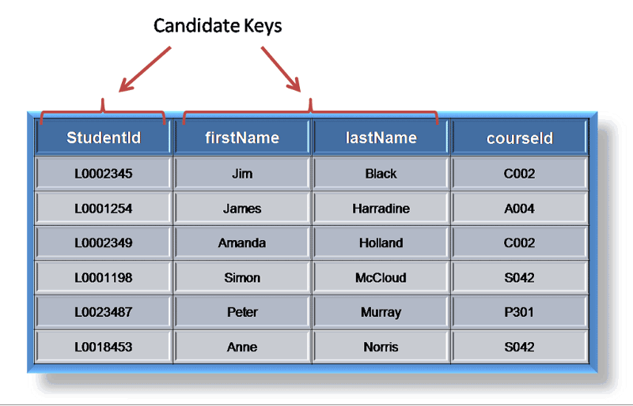

### **ทำไมต้องปรับปรุง?**

**การที่มีข้อมูลเดียวกันอยู่ในหลายตาราง** ทำให้เกิด **การซ้ำของข้อมูล** แล้วเกิดปัญหาเหล่านี้ตามมา

*   **เปลือง**! เนื้อที่เก็บข้อมูล
*   **ปัญหาตอน Update ข้อมูล** อาจเกิดมีการผิดพลาด ยิ่งมีเยอะก็ยิ่งต้องตรวจสอบเยอะ เช่นตอน Update แล้วก็ต้องเช็ค ข้อมูลอีกว่าตรงกันไหม
*   **ตอน Insert ข้อมูล** อาจมีการผิดพลาดในการเพิ่ม เช่น เผลอใส่ Primary key เป็นค่าว่าง
*   **ตอน Delete ข้อมูล** เช่น อาจไปเผลอลบ ข้อมูลที่มีการเชื่อมด้วย Forign Key### แล้วจะปรับปรุงได้อย่างไร?

ทำข้อมูลให้อยู่ใน **รูปแบบบรรทัดฐาน(normalization)**

#### **รูปแบบบรรทัดฐาน(normalization) มันคืออะไร ?**

*   เป็นมาตฐานที่ มีหลายระดับ และมีขั้นตอนที่ชัดเจน

#### ทำ normalization แล้วได้อะไร?

*   ทำให้นำข้อมูลไปใช้ได้อย่างมีประสิทธิภาพ โดยที่ไม่เกิดความซ้ำซ้อน### คำที่ต้องรู้ใว้ก่อนทำ **normalization**

เราเรียกคำเหล่านี้ว่า **Dependency Rule** เป็นกฎที่ใว้เรียกความสัมพันธ์ ของ แอทริบิวต์ในแต่ล่ะ รีเลชั่น

*   **Functional Dependency** เป็นความสัมพันธ์ของ Primary Key ที่ใช้ระบุ แอททริบิวต์อื่น

ตัวอย่าง :

ตาราง SUPPLIER

SNO สามารถระบุค่า SNAME , CITY นับเป็น **Functional Dependency** เพราะเป็น Primary key ที่ใช้ระบุค่าอื่น

*   **Partial Dependency** เป็นความสัมพันธ์ที่ใช้ Primary key แค่บางตัวในการระบุ แอททริบิววต์อื่น

ตัวอย่าง :

ตาราง ORDER1

SNO,PNO สามารถระบุค่า PNAME , QTY นับเป็น Functional Dependency แบบ **Full Functional Dependency หรือ FFD** เพราะถือว่าใช้ทุก Key

PNO สามารถระบุค่า PNAME ได้ด้วย นับเป็น **Partial Dependency** เพราะใช้ค่า key ตัวเดียวในตารางการระบุ

*   **Transitive Dependency** เป็นความสัมพันธ์ของ แอททริบิวต์ ที่ไม่ใช่ key แต่ใช้ระบุ ค่าของ แอททริบิวต์ อื่นได้

ตัวอย่าง :

ตาราง SUPPLIER1

SNO สามารถระบุค่า SNAME,CITY,RATING นับเป็น **Functional Dependency**

CITY สามารถระบุค่า RATING นับเป็น **Transitive Dependency** เพราะ city ไม่ใช่ key

*   Multivalued Dependency เป็นความสัมพันธ์ระหว่างแอททริบิวต์ ที่ใช้ ระบุได้หลายแอททริบิวต์ แต่ไม่ใช่ใน แถวเดียวกัน

ตัวอย่าง :

ตาราง SPJC

SNO สามารถระบุค่า PJNO ได้หลายค่า ถือว่าเป็น **Mutivalued Dependency**

SNO สามารถระบุค่า CITY ได้หลายค่า ถือว่าเป็น **Mutivalued Dependency**

*   **Join Dependency** การเชื่อมแอททริบิวต์ที่เหมือนกัน ระหว่างรีเรชั่นที่ต่างกัน

ตัวอย่าง :

อีกคำที่ต้องรู้แต่ไม่อยู่ในกฎ

**Candidate Key** คือ แอททริบิวต์ที่ มีความสามารถที่จะเป็น Primary key ได้

ตัวอย่าง :

ที่มา [http://rdbms.opengrass.net/2_Database%20Design/2.1_TermsOfReference/2.1.2_Keys.html](http://rdbms.opengrass.net/2_Database%20Design/2.1_TermsOfReference/2.1.2_Keys.html)

firstName และ lastName ถือว่าเป็น **Candidate Key** เพราะ ใช้ระบุค่าอื่นๆ ในตารางได้ครบถ้วนเหมือน Primary key### แล้ววิธีทำ normalization ล่ะ ?

การทำ Normalization จะต้องทำเป็นขั้นตอน โดยเริ่มจาก **Unnormalized Form หรือ ข้อมูลดั้งเดิม &gt; 1NF &gt; 2NF &gt; 3NF &gt; BCNF &gt; 4NF &gt; 5NF** จนได้รูปแบบของ Higher normal forms โดยที่ห้ามข้ามขั้นตอน ถ้าไม่อยู่ในรูปแบบก่อนหน้า เช่น ถ้าไม่อยู่ในรูปของ 1NF จะข้ามไปทำ 3NF เลยไม่ได้

โดยขั้นตอนการทำแบบสั้นๆ มีดังนี้

*   เริ่มที่ **Unnormalized Form** หรือ ตารางที่ยังไม่ถูก Nomalization

คือตาราง ที่ยังมีค่าซ้ำกันใน 1 ช่อง ยกตัวอย่างเช่น

*   1NF เป็นขั้นตอนการปรับปรุง ค่าที่**ซ้ำกัน**ให้แยกกัน
*   2NF เป็นขั้นตอนที่ใช้กำจัด **Partial Dependency**
*   3NF เป็นขั้นตอนที่ใช้กำจัด **Transitive Dependency**
*   BCNF เป็นขั้นตอนที่ใช้กำจัด **Candidate Key**
*   4NF เป็นขั้นตอนที่ใช้กำจัด **Mutivalued Dependency**
*   5NF จะเป็นการ **Join Dependency** แล้ว ได้ตารางที่เหมือนเดิม

โดยที่**การกำจัด**ในที่นี้ไม่ใช่การกำจัดคอลัมนั้นทิ้งไปเลย แต่เป็นการไป**สร้างตารางใหม่**### ตัวอย่างการทำ normalization

#### First Normal From : 1NF

นี้คือตารางในรูปแบบ **Unnormalized Form** จะต้องทำให้อยู่ในรูปของ **1NF**

ตารางในรูปของ Unnormalized Form

โดยสามารถทำให้อยู่ในรูปแบบ 1NF ได้โดยการกระจายข้อมูล

ตารางที่อยู่ในรูปของ 1NF

ตาราง ClientRental (**_clientNo_**, **_propertyNo_**, cName, pAddress, rentStart,  
rentFinish, rent, ownerNo, oName)

#### Second normal form: 2NF

จากตารางที่ได้เป็น 1NF แล้ว มีความสัมพันธ์กันในแต่ล่ะ แอททริบิวต์ดังงนี้

โดยเราต้องแยก ความสัมพันธ์ FD2 และ FD3 ออกเป็นตารางใหม่ เพราะเป็น Partial dependency จะได้เป็น

โดยที่จะได้เป็น 3 ตาราง คือ

Rental (**_clientNo_**, **_propertyNo_**, rentStart, rentFinish)  
◦ มาจาก ClientRental ของเดิม  
Client (**_clientNo_**, cName)  
◦ ที่แตกออกมาใหม่  
PropertyOwner (**_propertyNo_**, pAddress, rent, ownerNo,  
oName)  
◦ ที่แตกออกมาใหม

#### Third normal form : 3NF

จากในขั้นตอน 2NF เมื่อพิจารณาทุกตารางแล้วจะได้ความสัมพันธ์ดังนี้

จะเห็นว่า

ตาราง client เป็น 3NF แล้ว

ตาราง Rental เป็น 3 NF แล้ว

ตาราง PropertyOwner มี **Transitive dependency** ไม่เป็น 3NF เพราะฉะนั้นต้องแยก ownewNo และ oName ออกมาเป็นตารางใหม่

โดยส่วยมากแล้วการกำจัดตารางจะหมดที่ขั้นตอนนี้ แต่อาจจะมีบางตารางที่สามารถกำจัด ได้อีก

#### Boyce-Codd normal form : BCNF

จากขั้นตอน ก่อน จะเห็นว่าในตาราง Rental มี Candidate Key อยู่แต่ตารางอื่นๆ ไม่มีจึงมีแค่ ตาราง Rental ที่ยังไม่ใช่ BCNF

จึงต้องแยกออกมาเป็นตารางได้ดังนี้ แต่ไม่สามารถแยกได้เพราะ แยกไปมันก็คือตารางเดิม

ตัวอย่าง อื่นๆ ในการแยก

#### Fourth normal form: 4NF

คือการ ไม่มีการเกิด **Mutivalued Dependency**

ตัวอย่างการแยกตาราง และการเกิด **Mutivalued Dependency**

#### Fifth normal form: 5NF

คือการลองนำตารางที่ทำการแยกทั้งหมดนำกลับมาจอยกันแล้วต้องได้เหมือนใน 1NF

